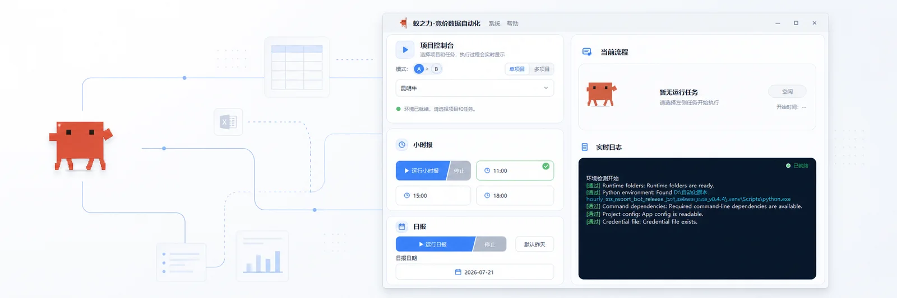
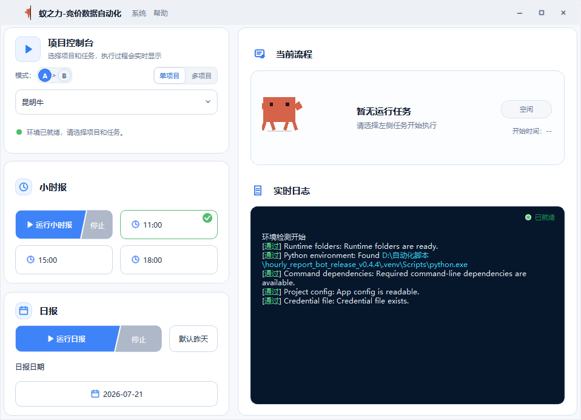
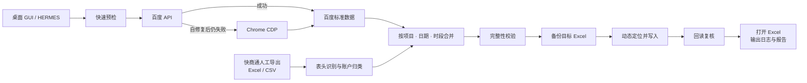
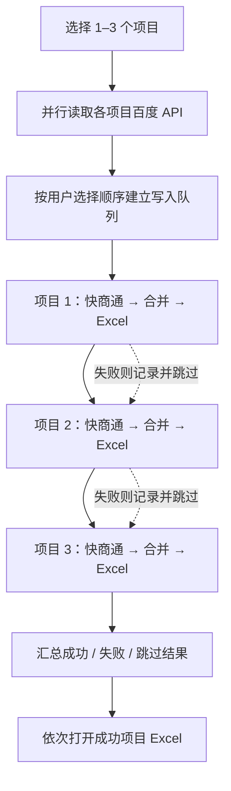
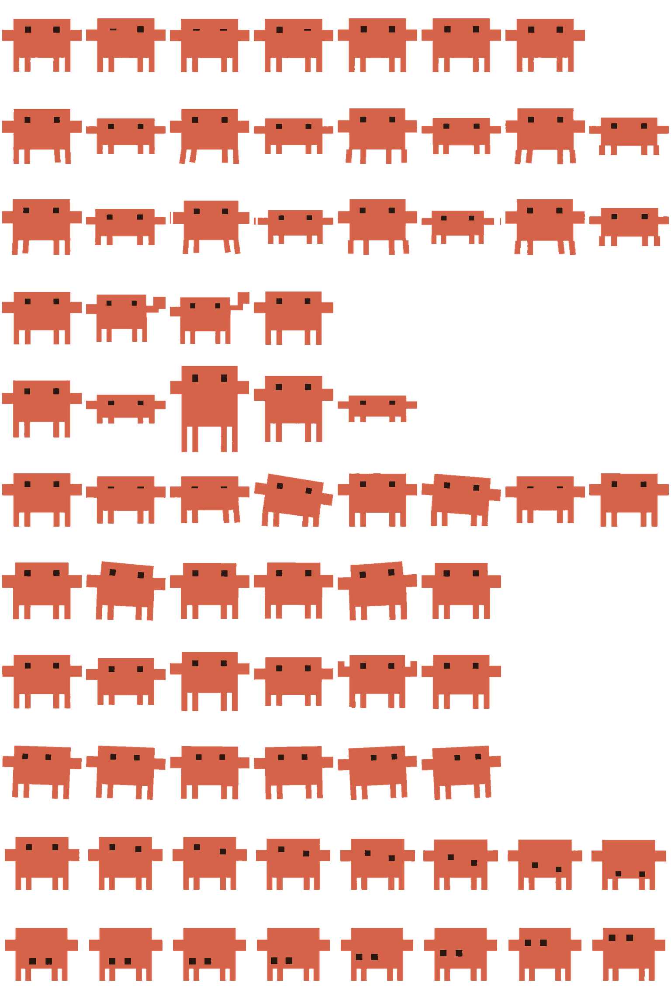

<p align="center">
  
</p>

<p align="center">
  
</p>

<h1 align="center">蚁之力 · 竞价数据自动化</h1>

<p align="center">
  <strong>面向 Windows 10/11 的百度竞价日报与小时报自动化工作台</strong><br>
  API 优先 · 浏览器兜底 · 快商通解析 · Excel 安全写入 · 多项目调度 · 在线更新
</p>

<p align="center">
  
  
  
  
</p>

<p align="center">
  
  
  
  
</p>

<p align="center">
  <a href="#产品一览">产品一览</a> ·
  <a href="#核心能力">核心能力</a> ·
  <a href="#运行架构">运行架构</a> ·
  <a href="#快速开始">快速开始</a> ·
  <a href="#excel-安全边界">Excel 安全</a> ·
  <a href="#发布与更新">发布更新</a>
</p>

> 把重复、机械、容易抄错的竞价数据工作交给程序；把模板、凭据和业务数据留在本地。

---

## 产品一览

<p align="center">
  
</p>

<p align="center"><sub>真实 2026.7.22.109 桌面界面：项目选择、数据模式、小时报、日报、当前流程与实时日志集中在一个窗口。</sub></p>

<table>
  <tr>
    <td width="33%" valign="top">
      <strong>API First</strong><br><br>
      百度 API 为生产主通道，内置 Token 刷新、网络重试和数据完整性复核；单项目失败后才整体降级 Chrome。
    </td>
    <td width="33%" valign="top">
      <strong>Excel Safe</strong><br><br>
      写入前备份，按表头识别目标区域，写入后回读复核；不重建工作簿，不碰无关 sheet 与公式区。
    </td>
    <td width="33%" valign="top">
      <strong>Multi Project</strong><br><br>
      最多选择 3 个项目。百度 API 并行读取，快商通解析与 Excel 写入按选择顺序串行执行。
    </td>
  </tr>
</table>

竞价日报原本是一条机械但不容出错的链路：登录百度后台、读取展现点击消费、导出快商通数据、按账户与时段对齐，再写入多个项目的 Excel 模板。

**蚁之力 · 竞价数据自动化**把这条链路收束成一个本地桌面工具。同事只需选择项目、时段或日期并启动任务，程序负责读取、解析、合并、备份、写入、复核和汇总。

> 当前版本只服务百度竞价日报与小时报，不做 QQ/微信自动发送，不操作快商通客户端，不做 OCR，也不把业务数据交给外部 AI 分析服务。

## 核心能力

| 模块 | 能力 | 关键保障 |
|:--|:--|:--|
| 百度数据 | API 优先，Chrome CDP 降级 | 刷新 1 次、网络额外重试 2 次、完整性额外读取 1 次，总预算 20 秒 |
| 快商通数据 | 读取人工导出的 Excel/CSV | 按表头识别字段，不写死列号；无法归属的数据进入报告 |
| 小时报 | 11 点、15 点、18 点 | 百度、快商通、合并、Excel 写入四阶段可追踪 |
| 日报 | 默认昨天，也可指定日期 | 表格稳定性等待、基础完整性校验、写后复核 |
| 多项目 | GUI 选择 1–3 个项目 | API 并行、Excel 串行；失败项目跳过，成功项目继续 |
| Excel | 模板内安全写入 | 自动备份、动态定位、恢复筛选与保护元数据 |
| 桌面端 | 固定 GUI、托盘、小螃蟹宠物 | 实时日志、历史日志、单实例、任务状态反馈 |
| 运维 | 在线更新与维护工具 | GitHub Release 更新、依赖锁定、脱敏诊断包、日志归档 |

## 运行架构

### 单项目数据链路



### 多项目调度



多项目模式不启动浏览器，也不从 API 降级到浏览器。某个项目 API 失败时只跳过该项目，其他项目继续；点击停止只阻止下一个排队项目，当前正在写入的项目会安全完成。

## 快速开始

<details open>
<summary><strong>同事电脑首次安装</strong></summary>

管理员只需分发完整安装器：

```text
Hourlyreport_automation_setup_v2026.7.23.111.exe
```

安装器会部署程序、默认项目配置、桌面快捷方式和开始菜单入口。首次启动自动检查运行环境；缺少环境时安装隔离的项目专用 Python 3.14.5，不修改系统 Python，也不要求卸载电脑已有版本。

真实账号密码和 OAuth Token 不进入安装器，需要由管理员通过 `.baidu-secrets` 配置包导入。
</details>

<details open>
<summary><strong>GUI 日常操作</strong></summary>

1. 双击 `hourlyreport_automation.exe`。
2. 选择单项目，或切换多项目并按顺序选择最多 3 个项目。
3. 选择模式：`A > B` 为 API 优先、浏览器兜底；`B > A` 为强制浏览器。
4. 小时报选择 11 点、15 点或 18 点；日报默认昨天，也可指定日期。
5. 查看“当前流程”和“实时日志”，完成后按系统设置打开目标 Excel。

多项目选择会自动记住，下次切换多项目时继续使用上一次组合。
</details>

<details>
<summary><strong>HERMES / 夏思道固定入口</strong></summary>

自动代执行必须使用固定 BAT，不要绕过 BAT 自行拆分命令：

```cmd
run_hermes_hourly.bat 11点
run_hermes_hourly.bat 15点
run_hermes_hourly.bat 18点
run_hermes_daily.bat
run_hermes_daily.bat 2026-07-09
```

BAT 会固定工作目录、UTF-8 环境和 `.venv` Python，并先执行快速预检。预检失败时立即停止，不写 Excel。
</details>

<details>
<summary><strong>开发与排障命令</strong></summary>

```cmd
:: 环境诊断
.venv\Scripts\python.exe main.py --mode doctor

:: 快速预检
.venv\Scripts\python.exe main.py --mode preflight --quick

:: 百度 API 只读验收，不读写 Excel，不启动 Chrome
.venv\Scripts\python.exe main.py --mode test-baidu-api-readiness

:: 多项目小时报 / 日报
.venv\Scripts\python.exe main.py --mode run-multi --projects kunming_niu,ningbo_niu --task hourly --period 11点
.venv\Scripts\python.exe main.py --mode run-multi --projects kunming_niu,nanjing_bai --task daily --date 2026-07-21

:: 维护工具
.venv\Scripts\python.exe main.py --mode diagnostic-bundle
.venv\Scripts\python.exe main.py --mode archive-logs
.venv\Scripts\python.exe main.py --mode lock-dependencies

:: 基础测试
.venv\Scripts\python.exe -m pytest tests\test_basic.py
```
</details>

## 数据模式

| GUI | 配置值 | 行为 |
|:--|:--|:--|
| `A > B` | `api` | 生产默认。先走百度 API；有限自修复仍失败后，单项目整体降级浏览器 |
| `B > A` | `browser` | 紧急回退。完全不发起 API 请求，直接连接 Chrome CDP |

GUI、HERMES 和 CLI 共享应用级配置 `baidu_data_source_preference`。当前覆盖九个项目、十一个授权；沈阳牛和沈阳白是双来源项目，两路 API 必须全部成功才允许合并，禁止把 API 与浏览器的部分结果拼成半套数据。

Token 过期时，生产流程会先备份再原子更新 `secrets/secrets.json`；原文件和备份均属于敏感文件，禁止写入日志、诊断包、发布包或 Git。

## 业务口径

<details>
<summary><strong>快商通小时报字段</strong></summary>

| Excel 字段 | 快商通标签来源 | 说明 |
|:--|:--|:--|
| 总对话 | 有访客消息的有效行 | 只统计访客消息数大于 0 的行 |
| 有效对话 | `有效-三句话` + `转潜-有效` | 不包含 `有效-一般` |
| 一般有效 | `有效-一般` | 单独统计 |
| 有效转潜 | `转潜-有效` | 同时计入有效对话 |
| 总转潜 | 包含 `转潜-` 的标签 | 全部转潜类 |
</details>

<details>
<summary><strong>快商通日报字段</strong></summary>

日报与小时报保持同一口径：`有效-一般` 只进入“一般有效对话”，不进入“有效对话”；`转潜-有效` 同时进入“有效对话”和“有效转潜”。
</details>

## Excel 安全边界

> **宁可停止，也不猜着写。** Excel 是本项目风险最高的边界，任何结构不确定性都会中断流程并生成诊断信息。

1. 写入前必须备份目标 Excel。
2. 不重建工作簿，不修改无关 sheet。
3. 不修改公式区、汇总区、截图区和非目标区域。
4. 不写死单元格坐标，必须扫描表头、账户区域和字段名称。
5. 表结构不确定时停止，不猜测写入。
6. 写入后回读复核，并恢复筛选、保护等 UI 元数据。
7. API 与浏览器均失败时停止，不继续合并或写入。

## 工程结构

<details>
<summary><strong>展开目录结构</strong></summary>

```text
hourly_report_bot_release_v0.4.4/
├─ hourlyreport_automation.exe        # 桌面主程序
├─ main.py                            # CLI 总入口
├─ menu.py                            # 控制台菜单
├─ install_env.bat                    # 首次环境安装与修复
├─ requirements-runtime.txt           # 运行依赖
├─ requirements-runtime.lock.txt      # 精确依赖锁定
├─ configs/
│  ├─ app_config.json                 # GUI 偏好、当前项目、数据模式
│  └─ projects/                       # 每项目一个 JSON
├─ secrets/
│  ├─ secrets.example.json
│  └─ secrets.json                    # 本地私有，不提交
├─ modules/
│  ├─ baidu_*                         # API、浏览器、登录态、授权
│  ├─ kst_*                           # 快商通解析
│  ├─ excel_*                         # Excel 检查、定位、写入
│  ├─ multi_project_*                 # 多项目选择、停止与调度
│  ├─ run_pipeline.py                 # 日报/小时报流程编排
│  ├─ preflight.py                    # 快速/完整预检
│  └─ maintenance.py                  # 依赖、诊断、日志维护
├─ gui/                               # PySide6 桌面界面
├─ docs/                              # SOP、设计与发布说明
├─ logs/                              # 本地运行日志
├─ reports/                           # JSON/CSV 运行报告
├─ backups/                           # Excel 写入前备份
├─ diagnostics/                       # 脱敏诊断包
└─ kst_exports/                       # 快商通人工导出数据
```
</details>

## 发布与更新

<table>
  <tr>
    <td><strong>当前基线</strong><br><code>2026.7.23.111</code></td>
    <td><strong>Release Tag</strong><br><code>v2026.7.23.111</code></td>
    <td><strong>更新仓库</strong><br><a href="https://github.com/kaiteJiang/Hourlyreport-Automation">Hourlyreport-Automation</a></td>
  </tr>
</table>

```text
在线更新包：Hourlyreport_automation_v2026.7.23.111.zip
完整安装器：Hourlyreport_automation_setup_v2026.7.23.111.exe
```

版本号规则为 `发布年.月.日.永久累计序号`，累计序号跨日期永久递增。在线更新包只更新程序文件，不覆盖 `configs/`、`secrets/`、`logs/`、`reports/`、`backups/`、`diagnostics/`、`kst_exports/` 和 `browser_profile/`。

### 版本历史

| 版本 | 重点 |
|:--|:--|
| `2026.7.23.111` | 修复更新助手缺失模块导致“更新并重启”崩溃 |
| `2026.7.23.110` | 修复云端 Token 时区解析与多授权并发覆盖；更新 GitHub 用户名 |
| `2026.7.22.109` | 多项目 API 并行与 Excel 串行正式上线；修复在线更新后客户端退出但未重启 |
| `2026.7.22.108` | 完成后打开 Excel 全局控制；帮助菜单、关于页与手动检查版本 |
| `2026.7.22.107` | 快商通口径修正、隔离 Python 安装修复、依赖锁定、脱敏诊断包、日志归档 |
| `2026.7.19.106` | 标准 Windows 安装器、持久化日志、在线更新流程收敛 |
| `2026.7.19.105` | GUI 字体、数据模式与交互细节优化 |
| `2026.7.19.104` | API 优先桌面自动化与 GitHub Release 在线更新基线 |

完整中文更新说明见 [`docs/releases/`](docs/releases/)。

## 安全边界

| 保留在本机 | 永不进入发布包或 Git |
|:--|:--|
| 项目配置、Excel 路径、GUI 偏好 | `secrets/secrets.json`、`.baidu-secrets` |
| 运行日志、报告、备份、诊断包 | 真实账号密码、OAuth Token、secretKey |
| 快商通人工导出数据 | 浏览器 Profile、个人业务数据、未脱敏日志 |

- 百度应用 `secretKey` 只保存在腾讯云 SCF 环境变量。
- 桌面端只保存独立 HMAC 客户端密钥与 OAuth Token。
- 默认不启动 Edge；浏览器模式只使用 Google Chrome 调试端口。
- 日志、报告、测试和文档不得输出密码、Token 或密钥。

## 协作开发

所有 AI Agent、自动化助手和人工维护者都必须先阅读 [`AGENTS.md`](AGENTS.md)。其中定义了 Excel 安全、凭据保护、Chrome 策略、API 降级、多项目执行、测试和发布规则。

<details>
<summary><strong>小螃蟹动作资产</strong></summary>

<p align="center">
  
</p>

<p align="center"><sub>桌面宠物会跟随任务阶段切换动作，并承担轻量状态提示；它不参与业务数据处理。</sub></p>
</details>

---

<p align="center">
  
</p>

<p align="center">
  <strong>Local-first · API-first · Excel-safe</strong><br>
  <sub>Built for reliable SEM daily work on Windows.</sub>
</p>
