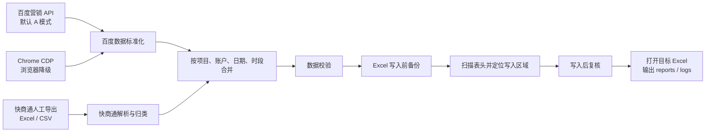

<p align="center">
  
</p>

<h1 align="center">蚁之力 · 竞价数据自动化</h1>

<p align="center">
  <strong>面向 Windows 10/11 的百度竞价日报与小时报自动化工具</strong><br>
  百度营销数据读取 · 快商通导出解析 · Excel 安全写入 · 桌面 GUI · 在线更新
</p>

<p align="center">
  
  
  
  
  
  
</p>

---

## 项目定位

竞价数据整理原本是一件很“机械但不能出错”的事：登录百度后台，抄展现、点击、消费；导出快商通对话数据；按账户和时段对齐；再把数据写进多个项目的 Excel 模板里。

**蚁之力 · 竞价数据自动化**把这套流程收束成一个本地桌面工具：

- 同事只需要打开 GUI，选择项目、时段或日期，然后点击“小时报 / 日报”。
- 程序优先通过百度 API 读取数据，失败时自动降级到 Chrome 浏览器抓数。
- 快商通仍使用人工导出的 Excel/CSV 文件，程序负责解析、归类和合并。
- 写入 Excel 前自动备份，写入后自动复核，不重建工作簿，不乱动无关 sheet。
- 支持 GitHub Releases 在线更新，适合公司内部多台电脑同步使用。

> 当前版本专注于百度竞价日报/小时报。它不做 QQ 自动发送，不操作快商通客户端，不做 OCR，不把任何数据发到外部分析服务。

## 核心能力

| 能力 | 说明 |
|:--|:--|
| 百度数据读取 | 默认 API 优先；API 配置、授权、Token、网络或完整性失败时有限自修复，仍失败则整项目降级 Chrome CDP |
| 快商通解析 | 读取同事手动导出的 Excel/CSV，按表头识别字段，不写死列号 |
| 小时报 | 支持 11 点、15 点、18 点三段数据写入 |
| 日报 | 默认处理昨天，也可指定日期 |
| 多项目 | 当前 9 个正式项目，含沈阳牛、沈阳白双百度来源合并 |
| Excel 安全写入 | 写前备份、表头扫描定位、写后复核、保留筛选/保护等 UI 元数据 |
| 桌面 GUI | 固定窗口、项目选择、数据模式切换、实时日志、小螃蟹桌面宠物、托盘常驻 |
| 在线更新 | GUI 启动后检查 GitHub Release，新版可一键下载并重启更新 |
| 维护工具 | 依赖锁定、脱敏诊断包、旧日志归档 |

## 数据流程



## 当前业务口径

### 快商通小时报字段

| Excel 字段 | 快商通标签来源 | 说明 |
|:--|:--|:--|
| 总对话 | 有访客消息的有效行 | 只统计访客消息数大于 0 的行 |
| 有效对话 | `有效-三句话` + `转潜-有效` | 不包含 `有效-一般` |
| 一般有效 | `有效-一般` | 单独统计 |
| 有效转潜 | `转潜-有效` | 同时计入有效对话 |
| 总转潜 | 包含 `转潜-` 的标签 | 全部转潜类 |

### 快商通日报字段

日报与小时报口径一致：`有效-一般` 只进入“一般有效对话”，不进入“有效对话”；`转潜-有效` 同时进入“有效对话”和“有效转潜”。

## 使用方式

### 同事电脑首次安装

管理员提供完整安装器：

```text
Hourlyreport_automation_setup_v2026.7.22.107.exe
```

安装器会部署程序、默认项目配置、桌面快捷方式和开始菜单入口。首次启动时会自动检查运行环境，缺少环境时下载隔离的项目专用 Python 3.14.5，不使用、不修改、也不要求卸载系统 Python。

真实账号密码和 OAuth Token 不在安装器里，需要由管理员通过 `.baidu-secrets` 配置包导入。

### GUI 使用

```text
双击 hourlyreport_automation.exe
```

常用动作：

- 选择项目。
- 选择数据模式：`A > B` 表示 API 优先、浏览器兜底；`B > A` 表示强制浏览器。
- 点击“小时报”，选择 11 点、15 点或 18 点。
- 点击“日报”，默认昨天，也可选择日期。
- 任务完成后自动打开当前项目 Excel。

### HERMES 固定入口

HERMES / 夏思道 / 自动代执行必须走固定 BAT，不要绕过 BAT 自己拼命令：

```cmd
run_hermes_hourly.bat 11点
run_hermes_hourly.bat 15点
run_hermes_hourly.bat 18点
run_hermes_daily.bat
run_hermes_daily.bat 2026-07-09
```

BAT 会固定工作目录、UTF-8 环境、`.venv` Python，并先运行快速预检。预检失败则停止，不继续写 Excel。

### 开发与排障命令

```cmd
:: 环境自检
.venv\Scripts\python.exe main.py --mode doctor

:: 快速预检
.venv\Scripts\python.exe main.py --mode preflight --quick

:: 百度 API 只读验收：不读写 Excel，不启动 Chrome
.venv\Scripts\python.exe main.py --mode test-baidu-api-readiness

:: 生成脱敏诊断包
.venv\Scripts\python.exe main.py --mode diagnostic-bundle

:: 归档 14 天以前的日志
.venv\Scripts\python.exe main.py --mode archive-logs

:: 生成依赖锁定文件
.venv\Scripts\python.exe main.py --mode lock-dependencies

:: 全量基础测试
.venv\Scripts\python.exe -m pytest tests\test_basic.py
```

## 数据模式

| 模式 | 配置值 | 行为 |
|:--|:--|:--|
| API 优先 | `A` / `api` | 生产默认。先走百度 API；Token 刷新、网络重试、完整性重读均失败后，整项目降级浏览器 |
| 浏览器强制 | `B` / `browser` | 紧急回退。完全不发起 API 请求，直接使用 Chrome CDP |

GUI、HERMES 和命令行完整任务共享同一个应用级偏好键 `baidu_data_source_preference`。当前为九个项目、十一个授权；沈阳牛、沈阳白为双来源项目。
Token 过期时可按生产规则备份并原子更新 `secrets/secrets.json`，原文件和备份均为敏感文件；开发验收入口只读百度数据，不读写 Excel。

沈阳牛、沈阳白为双来源项目：两路 API 必须全部成功后才合并；任一路失败则丢弃 API 临时结果，整项目降级浏览器，禁止 API 与浏览器混合半套数据。

## Excel 安全原则

这个项目最重要的边界是：**宁可停止，也不要猜着写 Excel。**

写入规则：

1. 写入前必须备份目标 Excel。
2. 不重建工作簿。
3. 不修改无关 sheet。
4. 不修改公式区、汇总区、截图区和非目标区域。
5. 不写死单元格坐标；必须扫描表头、账户区域和字段名定位。
6. 表结构不确定时中断并输出诊断报告。
7. 写入后必须回读复核。
8. 保存后恢复筛选、保护等 UI 元数据，避免破坏同事原模板习惯。

## 目录结构

```text
hourly_report_bot_release_v0.4.4/
├─ hourlyreport_automation.exe        # 桌面主程序，发布后位于安装目录根部
├─ main.py                            # CLI 总入口
├─ menu.py                            # 控制台菜单
├─ install_env.bat                    # 环境安装与修复
├─ requirements-runtime.txt           # 可读运行依赖
├─ requirements-runtime.lock.txt      # 精确运行依赖锁定
├─ configs/
│  ├─ app_config.json                 # 当前项目、GUI 偏好、数据模式等
│  └─ projects/                       # 每项目一个 JSON
├─ secrets/
│  ├─ secrets.example.json
│  └─ secrets.json                    # 真实凭据，本地私有，不提交
├─ modules/
│  ├─ baidu_*                         # 百度 API / 浏览器 / 登录态 / 授权
│  ├─ kst_*                           # 快商通导出解析
│  ├─ excel_*                         # Excel 检查、定位、写入
│  ├─ run_pipeline.py                 # 日报/小时报编排
│  ├─ preflight.py                    # 快速/完整预检
│  ├─ maintenance.py                  # 依赖锁定、诊断包、日志归档
│  └─ validators.py                   # 数据一致性校验
├─ gui/                               # PySide6 桌面界面
├─ docs/                              # SOP、发布说明、设计文档
├─ logs/                              # 运行日志，本地生成
├─ reports/                           # JSON/CSV 诊断报告，本地生成
├─ backups/                           # Excel 写入前备份
├─ diagnostics/                       # 脱敏诊断包，本地生成，不打包发布
└─ kst_exports/                       # 快商通人工导出文件
```

## 发布与更新

当前标准安装器基线：

```text
2026.7.22.107
```

版本号规则：

```text
发布年.月.日.永久累计序号
例如：2026.7.22.107
```

GitHub Release 规则：

- 仓库：`179068898-dotcom/Hourlyreport-Automation`
- tag：`v2026.7.22.107`
- 在线更新包：`Hourlyreport_automation_v2026.7.22.107.zip`
- 完整安装器：`Hourlyreport_automation_setup_v2026.7.22.107.exe`
- 每次发布必须提供中文更新说明，见 `docs/releases/`。

在线更新包只包含程序文件，不覆盖：

- `configs/`
- `secrets/`
- `logs/`
- `reports/`
- `backups/`
- `diagnostics/`
- `kst_exports/`
- `browser_profile/`

## 安全边界

- 不提交 `secrets/secrets.json`、`.baidu-secrets`、真实账号密码、OAuth Token、个人导出数据。
- 不在日志、报告、文档、测试中输出密码、Token、secretKey。
- 脱敏诊断包只用于排障，不能替代真实授权配置包。
- 百度应用 secretKey 只保存在腾讯云 SCF 环境变量；桌面端只保存独立 HMAC 客户端密钥和 OAuth Token。
- 默认不启动 Edge；浏览器模式只使用 Google Chrome 调试端口。
- 不自动发送 QQ、微信或其他消息。

## 版本历史

| 版本 | 日期 | 重点 |
|:--|:--|:--|
| `2026.7.22.107` | 2026-07-22 | 快商通统计口径修正、隔离 Python 安装修复、依赖锁定、脱敏诊断包、日志归档 |
| `2026.7.19.106` | 2026-07-19 | 标准 Windows 安装器基线、持久化日志、在线更新流程收敛 |
| `2026.7.19.105` | 2026-07-19 | GUI 细节优化、数据模式控件调整 |
| `2026.7.19.104` | 2026-07-19 | API 优先桌面自动化与 GitHub Release 在线更新基线 |

## 给协作者

本仓库的开发规则以 [AGENTS.md](AGENTS.md) 为准。所有 AI Agent、自动化助手和人工维护者都必须遵守其中的 Excel 安全、凭据保护、Chrome 策略、API 降级和发布包规则。

---

<p align="center">
  <sub>Built for SEM daily work · Local-first · Excel-safe · API-first with browser fallback</sub>
</p>
